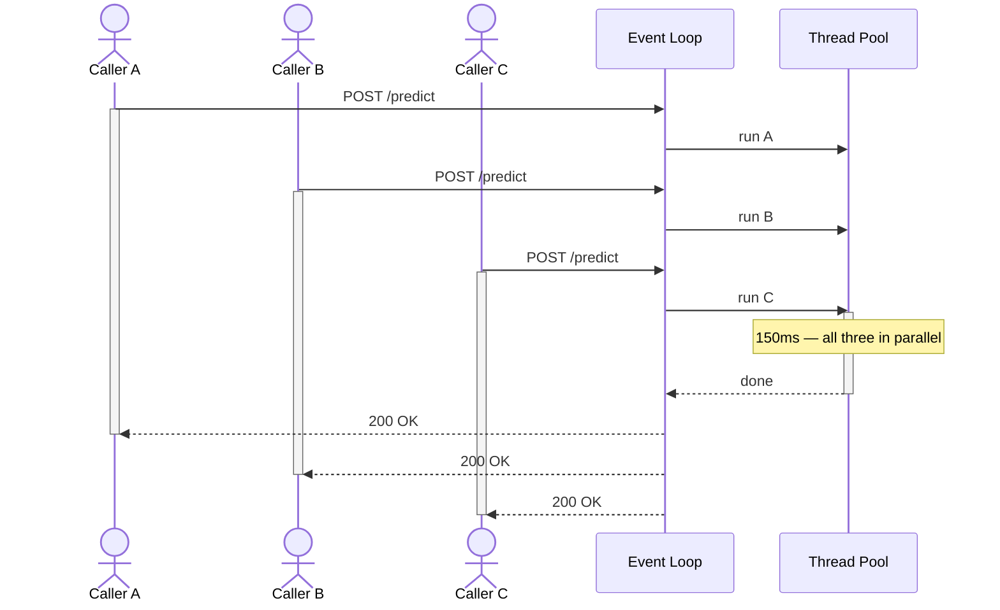

```mermaid
sequenceDiagram
    actor A as Caller A
    actor B as Caller B
    actor C as Caller C
    participant EL as Event Loop
    participant TP as Thread Pool

    A->>EL: POST /predict
    activate A
    EL->>TP: run A
    B->>EL: POST /predict
    activate B
    EL->>TP: run B
    C->>EL: POST /predict
    activate C
    EL->>TP: run C
    activate TP
    Note over TP: 150ms — all three in parallel
    TP-->>EL: done
    deactivate TP
    EL-->>A: 200 OK
    deactivate A
    EL-->>B: 200 OK
    deactivate B
    EL-->>C: 200 OK
    deactivate C
```
