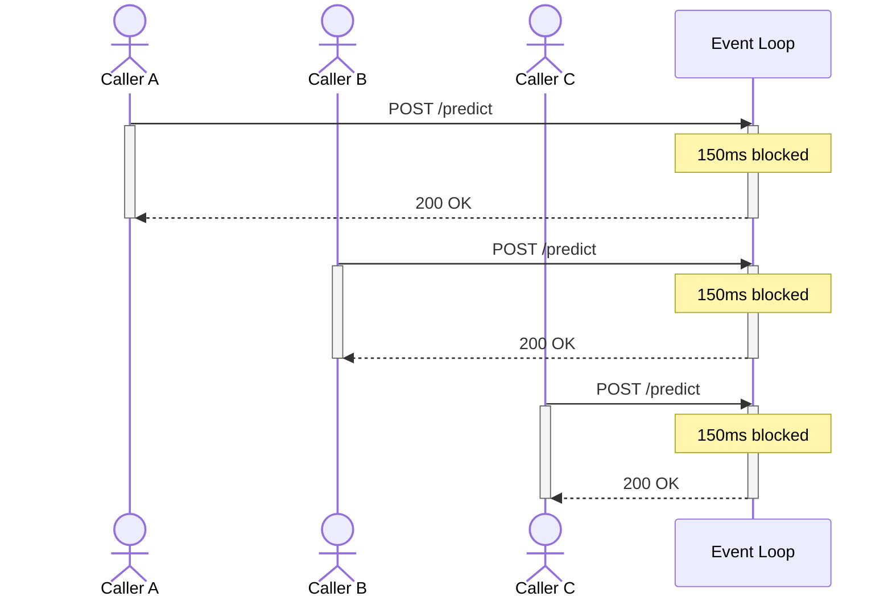

```mermaid
sequenceDiagram
    actor A as Caller A
    actor B as Caller B
    actor C as Caller C
    participant EL as Event Loop

    A->>EL: POST /predict
    activate A
    activate EL
    Note over EL: 150ms blocked
    EL-->>A: 200 OK
    deactivate EL
    deactivate A

    B->>EL: POST /predict
    activate B
    activate EL
    Note over EL: 150ms blocked
    EL-->>B: 200 OK
    deactivate EL
    deactivate B

    C->>EL: POST /predict
    activate C
    activate EL
    Note over EL: 150ms blocked
    EL-->>C: 200 OK
    deactivate EL
    deactivate C
```
