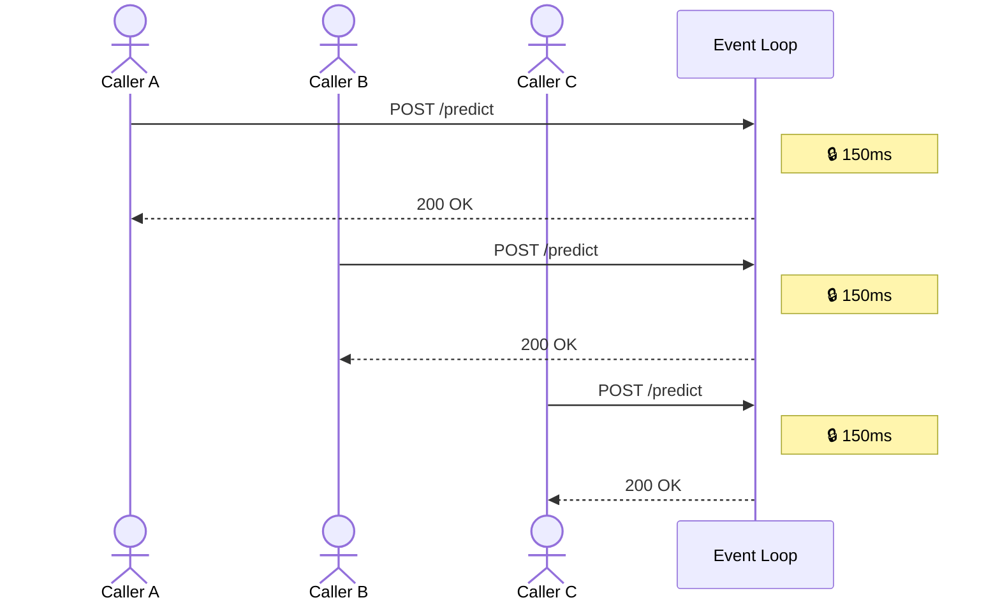
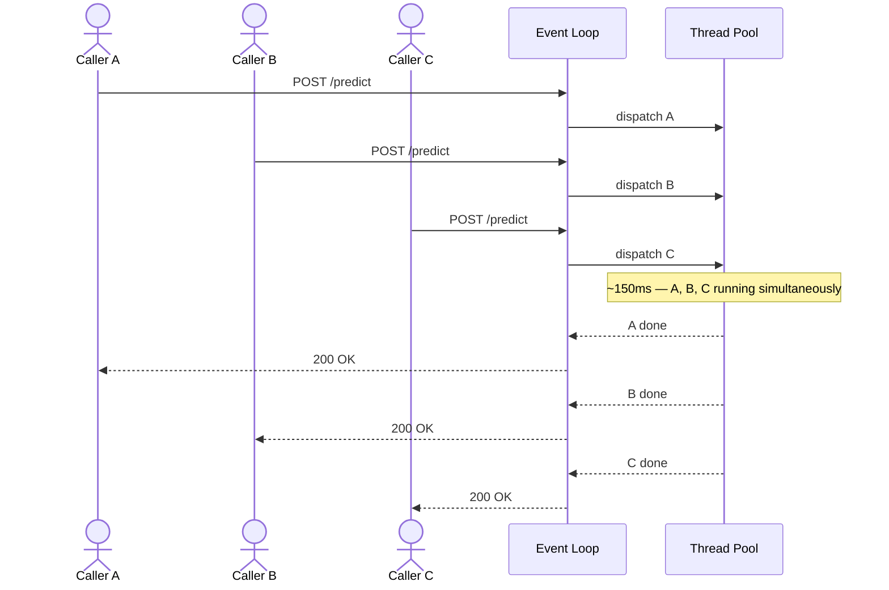

# Issue: Inference Serialisation

## The Problem

The original service defined the `/predict` endpoint as an `async` FastAPI handler. Inside that handler, `service.predict()` was called directly — a synchronous, blocking call.

In an async web framework, the event loop is a single thread that drives all concurrent requests. When a synchronous blocking call is made inside an async handler, the event loop cannot do anything else until that call returns. Every other request queued behind it.

With a model that takes 150ms per call and 50 concurrent callers, the expected behaviour is that all 50 requests complete in roughly 150ms. The actual behaviour was that they completed one at a time — total wall time of ~7.5 seconds.



## The Fix

`run_in_threadpool` offloads the blocking `model.predict()` call to FastAPI's worker thread pool. The event loop dispatches the call and immediately frees itself to accept and process other requests while inference runs on a background thread.



The change is a single line in the HTTP handler:

```python
# before
response = service.predict(parsed)

# after
response = await run_in_threadpool(service.predict, parsed)
```

## Proof

The service was run against a slow model (`SlowModel`, 150ms per call) and load tested with 50 concurrent requests using `demo_harness.py`.

**Before the fix** — requests processed one at a time. Server logs show each request starting only after the previous one completed:

```
16:09:37.846  predict start ...
16:09:38.010  predict start ...   ← +164ms
16:09:38.376  predict start ...   ← +366ms
16:09:38.527  predict start ...   ← +151ms
```

**After the fix** — all 50 requests start within milliseconds of each other:

```
16:14:23.890  predict start ...
16:14:23.894  predict start ...   ← +4ms
16:14:23.905  predict start ...   ← +11ms
16:14:23.972  predict start ...   ← +67ms
```

| | Before | After |
|---|---|---|
| Single call baseline | 165ms | 165ms |
| Wall clock (50 calls) | 7,768ms | 771ms |
| Verdict | 47x baseline | 4.7x baseline |

