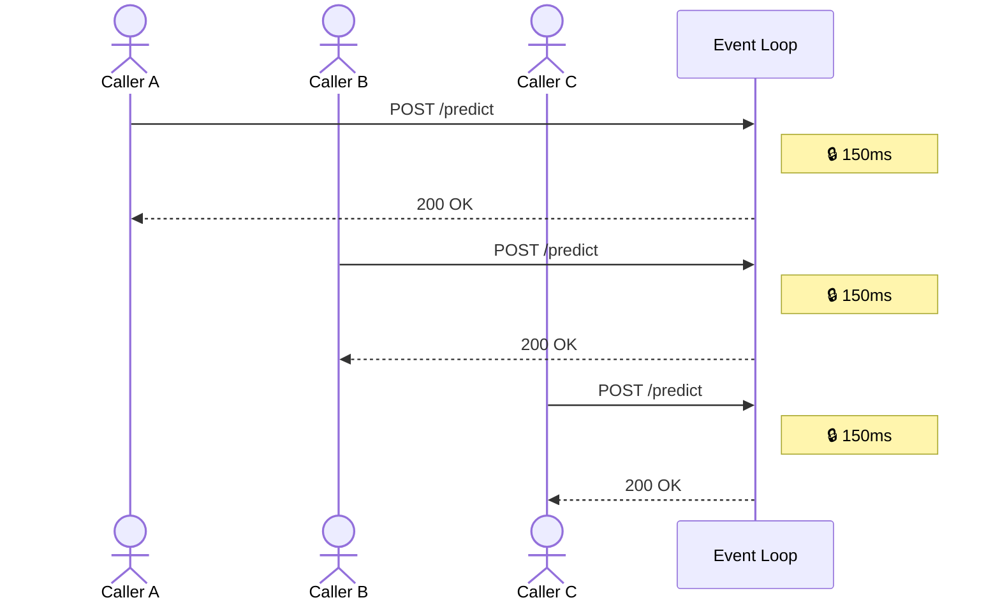
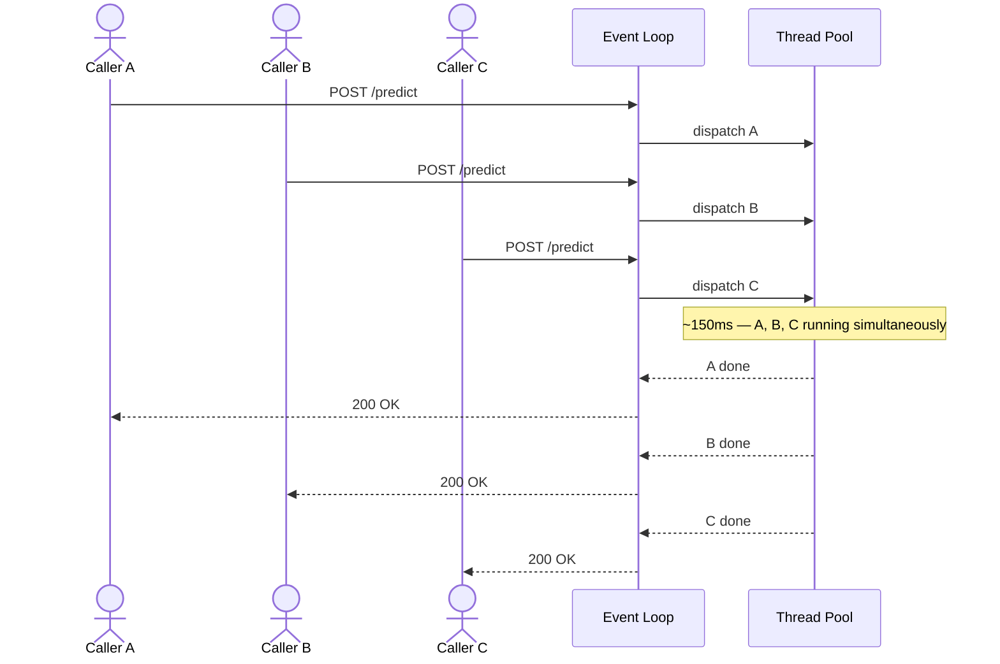

# Issue: Inference Serialisation

## The Problem

The original service defined the `/predict` endpoint as an `async` FastAPI handler. Inside that handler, `service.predict()` was called directly — a synchronous, blocking call.

In an async web framework, the event loop is a single thread that drives all concurrent requests. When a synchronous blocking call is made inside an async handler, the event loop cannot do anything else until that call returns. Every other request queued behind it.

With a model that takes 150ms per call and 50 concurrent callers, the expected behaviour is that all 50 requests complete in roughly 150ms. The actual behaviour was that they completed one at a time — total wall time of ~7.8 seconds.



## The Fix

`run_in_threadpool` offloads the blocking `model.predict()` call to FastAPI's worker thread pool. The event loop dispatches the call and immediately frees itself to accept and process other requests while inference runs on a background thread.



The change is a single line in the HTTP handler:

```python
# before
response = service.predict(parsed)

# after
response = await run_in_threadpool(service.predict, parsed)
```

## Proof

The service was run against `SlowModel` (150ms per call) with 50 concurrent requests using `demo_harness.py`.

**Serialised server** (`demo_slow_serialised:app`) — requests processed one at a time:

```
calls            :  50
single call      :   164.3 ms  (baseline)
wall clock total :  7784.7 ms  (47.4x baseline)
sum of latencies : 194592.1 ms
avg per call     :  3891.8 ms
max single call  :  7260.9 ms
```

**Parallel server** (`demo_slow_parallel:app`) — all 50 requests run concurrently:

```
calls            :  50
single call      :   164.8 ms  (baseline)
wall clock total :   794.8 ms  (4.8x baseline)
sum of latencies : 21040.1 ms
avg per call     :   420.8 ms
max single call  :   596.5 ms
```

| | Serialised | Parallel |
|---|---|---|
| Single call baseline | 164.3 ms | 164.8 ms |
| Wall clock (50 calls) | 7,784.7 ms | 794.8 ms |
| Ratio | 47.4x baseline | 4.8x baseline |

The wall clock drops from ~7.8 s to ~800 ms — a 10x improvement — with no change to model logic or output.

## Running the Demo

**Setup:**

```
source .venv/bin/activate
```

**Terminal 1 — start the server** (pick one):

```bash
# broken: blocking handler, requests serialise
uvicorn demo_slow_serialised:app

# fixed: thread-pool handler, requests run concurrently
uvicorn demo_slow_parallel:app
```

**Terminal 2 — run the harness:**

```bash
python demo_harness.py 50
```
