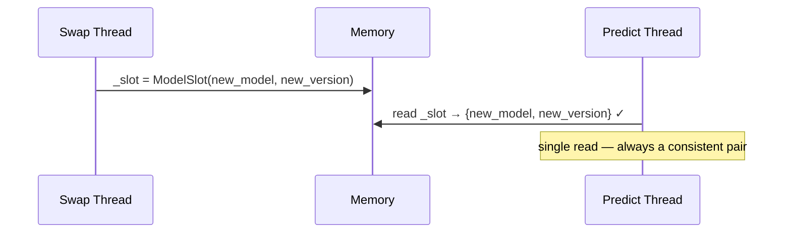

```mermaid
sequenceDiagram
    participant ST as Swap Thread
    participant MEM as Memory
    participant PT as Predict Thread

    ST->>MEM: _slot = ModelSlot(new_model, new_version)
    PT->>MEM: read _slot → {new_model, new_version} ✓
    Note over PT: single read — always a consistent pair
```
