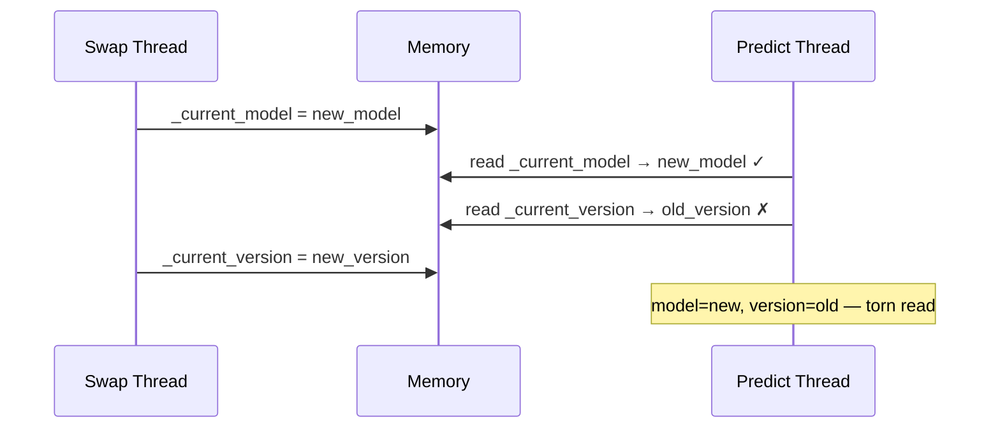

```mermaid
sequenceDiagram
    participant ST as Swap Thread
    participant MEM as Memory
    participant PT as Predict Thread

    ST->>MEM: _current_model = new_model
    PT->>MEM: read _current_model → new_model ✓
    PT->>MEM: read _current_version → old_version ✗
    ST->>MEM: _current_version = new_version
    Note over PT: model=new, version=old — torn read
```
