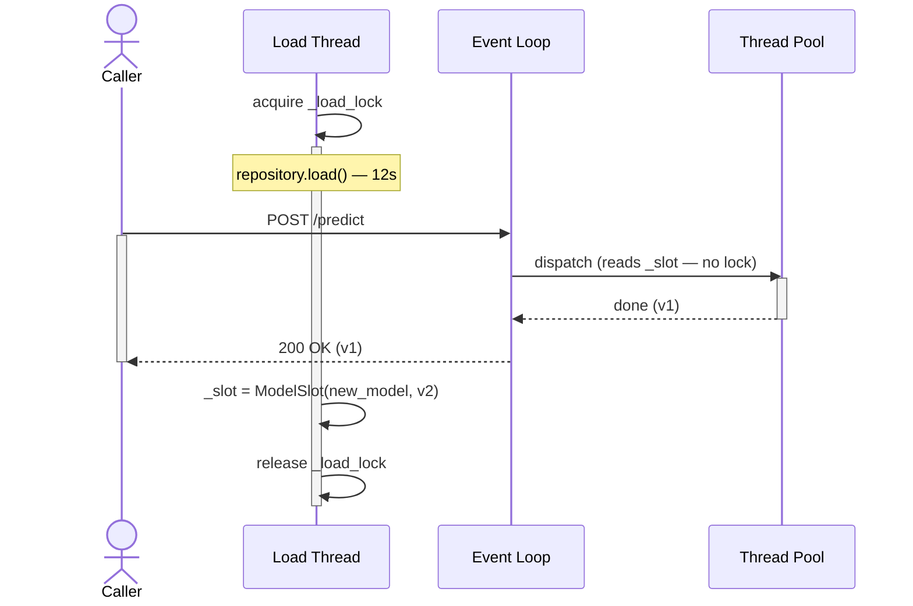

```mermaid
sequenceDiagram
    actor C as Caller
    participant LT as Load Thread
    participant EL as Event Loop
    participant TP as Thread Pool

    LT->>LT: acquire _load_lock
    activate LT
    Note over LT: repository.load() — 12s
    C->>EL: POST /predict
    activate C
    EL->>TP: dispatch (reads _slot — no lock)
    activate TP
    TP-->>EL: done (v1)
    deactivate TP
    EL-->>C: 200 OK (v1)
    deactivate C
    LT->>LT: _slot = ModelSlot(new_model, v2)
    LT->>LT: release _load_lock
    deactivate LT
```
