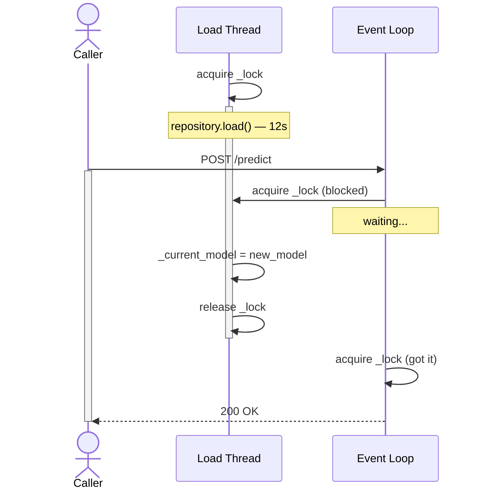

```mermaid
sequenceDiagram
    actor C as Caller
    participant LT as Load Thread
    participant EL as Event Loop

    LT->>LT: acquire _lock
    activate LT
    Note over LT: repository.load() — 12s
    C->>EL: POST /predict
    activate C
    EL->>LT: acquire _lock (blocked)
    Note over EL: waiting...
    LT->>LT: _current_model = new_model
    LT->>LT: release _lock
    deactivate LT
    EL->>EL: acquire _lock (got it)
    EL-->>C: 200 OK
    deactivate C
```
