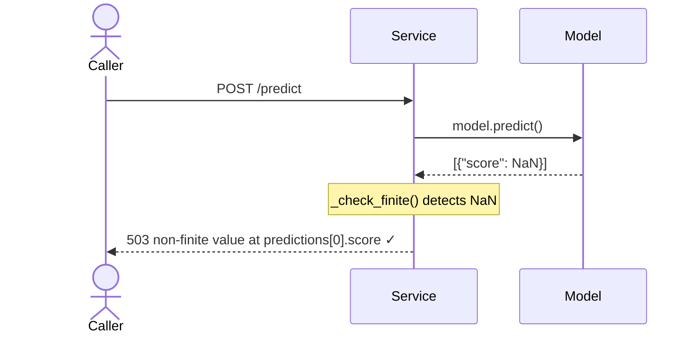

```mermaid
sequenceDiagram
    actor C as Caller
    participant S as Service
    participant M as Model

    C->>S: POST /predict
    S->>M: model.predict()
    M-->>S: [{"score": NaN}]
    Note over S: _check_finite() detects NaN
    S-->>C: 503 non-finite value at predictions[0].score ✓
```
