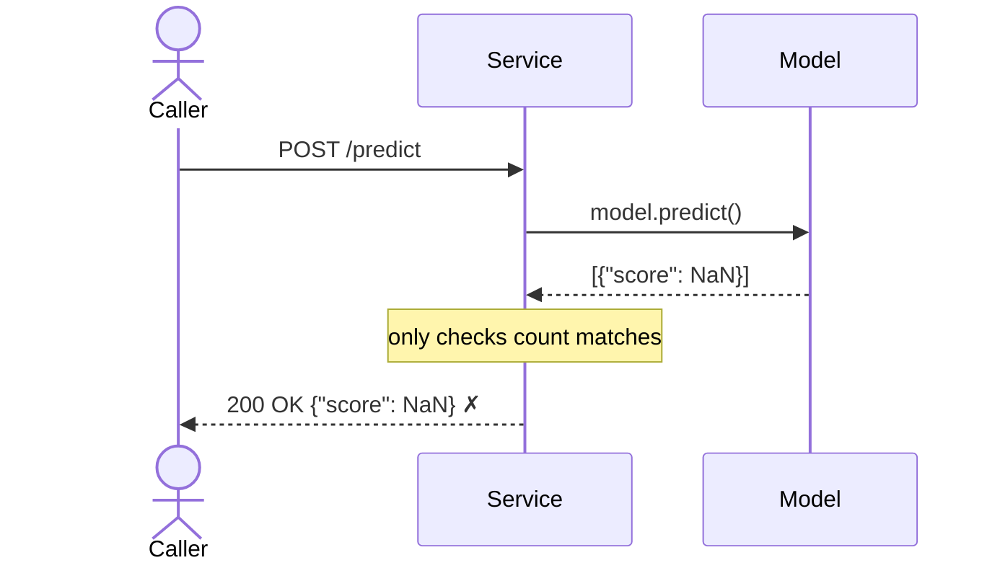

```mermaid
sequenceDiagram
    actor C as Caller
    participant S as Service
    participant M as Model

    C->>S: POST /predict
    S->>M: model.predict()
    M-->>S: [{"score": NaN}]
    Note over S: only checks count matches
    S-->>C: 200 OK  {"score": NaN} ✗
```
